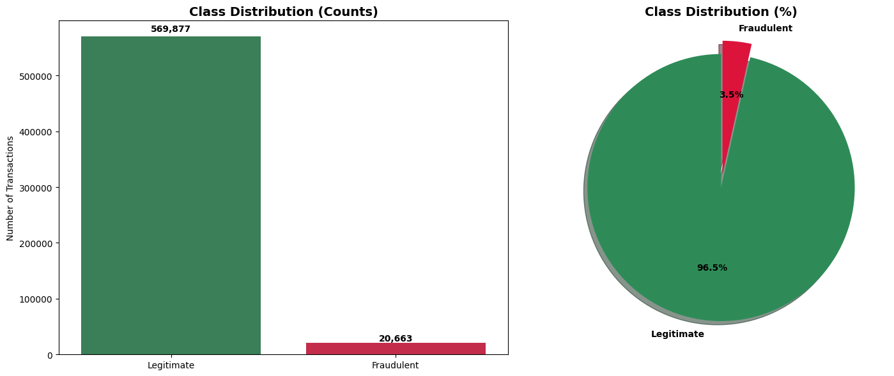
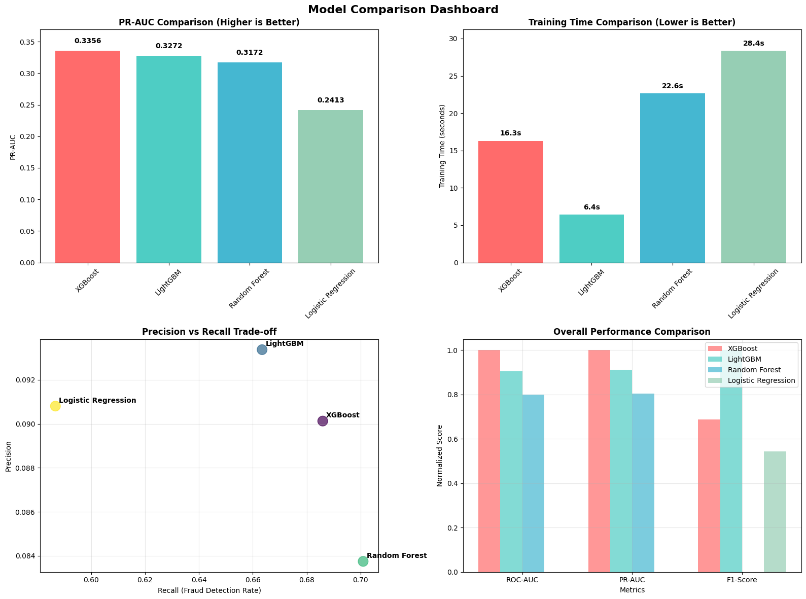
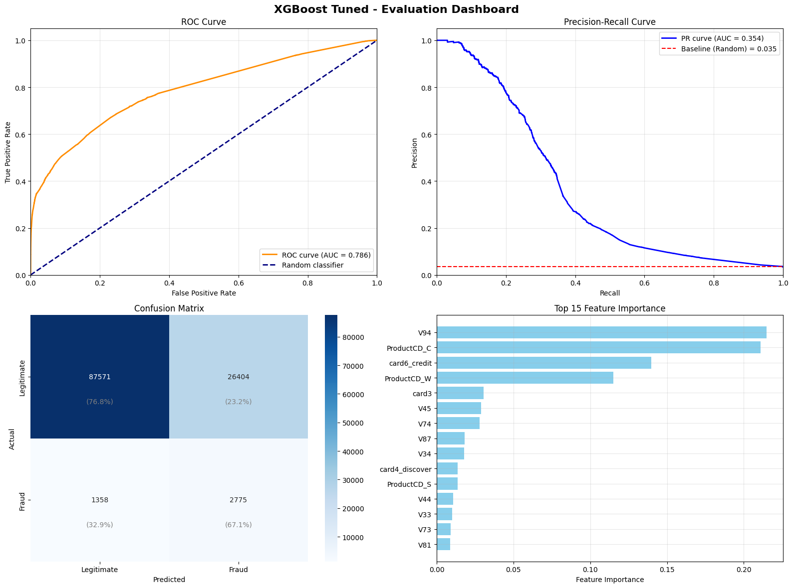

# Fraud Detection with Machine Learning


A production-style fraud detection pipeline built on the [IEEE-CIS Fraud Detection](https://www.kaggle.com/c/ieee-fraud-detection) dataset (Kaggle, 590K+ transactions). The project goes from raw EDA through model comparison, hyperparameter tuning, MLflow experiment tracking, and a containerized Flask API — the full path from notebook to deployable service.

**TL;DR**: The final tuned XGBoost model catches **~68% of fraudulent transactions** while flagging only **~15.5% of legitimate transactions** for review — about **19x better than random guessing** on a dataset where fraud makes up just 3.5% of all transactions.

## Table of Contents
- [Dataset](#dataset)
- [Project Structure](#project-structure)
- [Getting Started](#getting-started)
- [1. Exploratory Data Analysis](#1-exploratory-data-analysis)
- [2. Modeling](#2-modeling)
- [3. Results](#3-results)
- [4. Deployment](#4-deployment)
- [Design Decisions & Known Limitations](#design-decisions--known-limitations)
- [Next Steps](#next-steps)
- [Tech Stack](#tech-stack)

---

## Dataset

- **Source**: IEEE-CIS Fraud Detection competition (Kaggle)
- **Size**: 590,540 training transactions, 434 raw features (transaction + identity data merged on `TransactionID`)
- **Target**: `isFraud` (binary) — severe class imbalance at **3.5% fraud rate** (27.6:1 legitimate:fraud ratio)



Raw CSVs are not tracked in this repo (size + Kaggle licensing terms). Download `train_transaction.csv`, `train_identity.csv`, `test_transaction.csv`, `test_identity.csv` from the [competition page](https://www.kaggle.com/c/ieee-fraud-detection/data) and place them in a local `data/` folder before running the notebooks.

## Project Structure

```
├── notebooks/
│   ├── 01_fraud_detection_eda.ipynb          # Exploratory data analysis
│   └── 02_fraud_detection_modeling.ipynb     # Model training, tuning, deployment prep
├── final_model/
│   ├── model/                                # Trained model (.pkl)
│   ├── preprocessing/                        # Feature names, imputers
│   ├── metadata/                             # Model card, config
│   └── inference/                            # predict.py
├── app.py                                    # Flask API
├── Dockerfile
├── docker-compose.yml
├── run_docker.sh                             # Convenience script to build/run the container
├── test_docker.py                            # Tests for the containerized API
├── requirements.txt
├── PRD.md                                    # Product requirements document
├── .dockerignore
└── .gitignore
```

## Getting Started

```bash
# Clone the repo
git clone https://github.com/TumainiC/fraud_detection.git
cd fraud_detection

# --- Option A: Run the notebooks ---
python3 -m venv venv && source venv/bin/activate
pip install -r requirements.txt
# Download the Kaggle data into ./data/ (see Dataset section above)
jupyter notebook notebooks/01_fraud_detection_eda.ipynb

# --- Option B: Run the deployed API via Docker ---
./run_docker.sh
# or: docker-compose up -d
python test_docker.py   # sanity-check the running API
```

Once running, the API exposes `/health`, `/predict`, `/predict/batch`, `/model-info`, and `/threshold`.

---

## 1. Exploratory Data Analysis

Notebook: [`note_books/eda.ipynb`](note_books/eda.ipynb)

Key findings that shaped the modeling strategy:

- **Missing data**: 95% of columns have some missing values; 208 columns (48%) are >70% missing, mostly identity (`id_`) and behavioral (`M`) features.
- **Most predictive features**: Vesta's engineered `V` features dominate — `V45` (0.28 correlation with fraud), `V44`, `V86`/`V87`, `V52` — far ahead of raw `TransactionAmt` (0.01 correlation).
- **Categorical fraud signals**: `P_emaildomain = mail.com` (19% fraud rate vs. 3.5% average), `ProductCD = C` (11.7%), and `card4 = discover` (7.7%) all stand out as high-risk segments.
- **Feature category ranking** (predictive strength): V-features (dominant) > D-features (moderate) > C-features (weak) > M-features (unusable due to missingness).

Output: a cleaned, reduced feature set with zero missing values after median/mode imputation, refined further to 43 features in the modeling stage.

## 2. Modeling

Notebook: [`note_books/modeling.ipynb`](note_books/fraud_modeling.ipynb)

### Preprocessing
- Reduced 434 → 43 features (90% reduction) based on missingness thresholds, correlation, and business relevance.
- Median imputation for numerical features, mode imputation for categorical features.
- Feature engineering: `TransactionAmt_log`, hour-of-day and day-of-week extracted from `TransactionDT`.
- Mixed categorical encoding: one-hot for low-cardinality features (`ProductCD`, `card4`, `card6`), label encoding for higher-cardinality ones.
- Stratified train/validation split to preserve the 3.5% fraud rate.

### Models trained and compared

All experiments tracked with **MLflow**. Primary metric: **PR-AUC** (precision-recall AUC), chosen over accuracy/ROC-AUC because of the severe class imbalance — a model that predicts "legitimate" every time would score 96.5% accuracy while catching zero fraud.

| Model | PR-AUC | ROC-AUC | Training Time |
|---|---|---|---|
| Logistic Regression (baseline) | 0.2413 | 0.691 | 0.6s |
| Random Forest | 0.3169 | 0.759 | 38.3s |
| XGBoost | 0.3358 | 0.774 | 1.9s |
| LightGBM | 0.3275 | 0.773 | 0.4s |
| **XGBoost (tuned)** | **0.3530** | **0.786** | 49.0s |



- **Winner: XGBoost**, further improved by ~5.1% PR-AUC via `RandomizedSearchCV` (20 iterations, 3-fold CV) tuning `n_estimators`, `max_depth`, `learning_rate`, `subsample`, and `colsample_bytree`.
- Class imbalance handled via `class_weight='balanced'` (Logistic Regression, Random Forest, LightGBM) and `scale_pos_weight` (XGBoost).

## 3. Results



**Validation set confusion matrix (final tuned model, threshold = 0.5):**

|  | Predicted Legitimate | Predicted Fraud |
|---|---|---|
| **Actual Legitimate** | 166,305 (TN) | 30,542 (FP) |
| **Actual Fraud** | 2,213 (FN) | 4,678 (TP) |

- **Fraud catch rate**: 67.9% of all fraud transactions detected
- **False positive rate**: 15.5% of legitimate transactions flagged for review
- **~19x better than random** in terms of fraud detection given the 3.5% base rate

## 4. Deployment

- Model artifacts (trained model, preprocessing pipeline, metadata) saved under `final_model/`.
- Model registered in the **MLflow Model Registry**.
- A [model card](final_model/metadata/) documenting intended use, out-of-scope uses, limitations, and ethical considerations.
- Containerized via `Dockerfile` + `docker-compose.yml`, serving a **Flask API** (`app.py`) with endpoints:
  - `GET /health` — health check
  - `POST /predict` — single transaction scoring
  - `POST /predict/batch` — batch scoring
  - `GET /model-info` — model metadata
  - `POST /threshold` — update the decision threshold at runtime
- `run_docker.sh` — one-command build-and-run; `test_docker.py` — tests against the running container.
- `PRD.md` documents the product requirements this project was built against.

---

## Design Decisions & Known Limitations

Being upfront about trade-offs and gaps, rather than glossing over them:

- **Validation strategy**: the current split is a stratified random train/validation split, *not* an out-of-time split. Since `TransactionDT` is available and fraud patterns can drift over time, an out-of-time validation (train on earlier transactions, validate on later ones) would give a more realistic estimate of production performance. This is called out explicitly as a next step rather than left unaddressed.
- **Decision threshold**: 0.5 is used as the default, but the model card documents the trade-off curve — a 0.3 threshold pushes fraud detection above 80% at the cost of more false positives, while 0.7 cuts false positives to ~8% but drops detection to ~45%. The right threshold is a business decision, not a modeling one, and should be set based on the actual cost of a missed fraud vs. a false alarm.
- **Feature availability at inference**: the model needs all 43 engineered features present at scoring time, which adds a dependency on the preprocessing pipeline being kept in sync with training.
- **Static fraud rate assumption**: trained on a fixed 3.5% fraud rate; if the true rate shifts materially in production, recall/precision at a fixed threshold will shift too — this is why threshold monitoring is called out under Next Steps.

## Next Steps

- Add out-of-time validation (train/validate split by `TransactionDT`) to check for temporal drift.
- Add velocity/aggregation features: transaction frequency per card, historical fraud rate per email domain, device-switching patterns.
- Threshold optimization tied to an explicit cost matrix (cost of false negative vs. false positive).
- Load/latency testing of the Flask API ahead of production rollout.
- Set up automated data-drift monitoring on the 43 input features.

## Tech Stack

`pandas` · `numpy` · `scikit-learn` · `xgboost` · `lightgbm` · `matplotlib` / `seaborn` · `mlflow` · `Flask` · `Docker`

---

## Contact

Built by [J0Y ](https://github.com/JoyMurengi). Questions or feedback welcome via GitHub issues.
